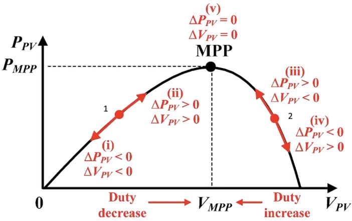
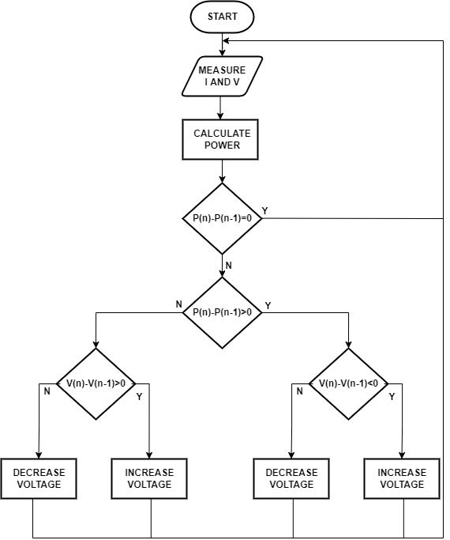

# mpptPOAlgorithm
The P&Q algorithm is the most commonly used approach in practice due to its simplicity in implementation. In this algorithm, the P-V characteristic of the photovoltaic panel is used. As is known, the power produced from photovoltaic panels varies as a function of voltage. In the error and observation algorithm, a small increase in the operating voltage of the PV panel is performed, and the amount of change in power ΔP is measured. If the ΔP value is positive, the operating voltage is increased again, bringing the PV panel operating point closer to the maximum power point. Thus, small errors are created in the voltage and the sign of the error occurring in the power is followed.

In the first region, ΔP = Instantaneous Power - Previous Power and ΔV = Instantaneous Voltage - Previous Voltage are less than zero. Therefore, we need to decrease duty cycle. It means voltage should be increased.
In the second region, ΔP = Instantaneous Power - Previous Power and ΔV = Instantaneous Voltage - Previous Voltage are greater than zero. Therefore, we need to decrease duty cycle. It means voltage should be increased.
In the third region, ΔP = Instantaneous Power - Previous Power is greater than zero and ΔV = Instantaneous Voltage - Previous Voltage is less than zero. Therefore, we need to increase duty cycle. It means voltage should be decreased.
In the fourth region, ΔP = Instantaneous Power - Previous Power is less than zero and ΔV = Instantaneous Voltage - Previous Voltage is greater than zero. Therefore, we need to increase duty cycle. It means voltage should be decreased.
The fifth region is the maximum power point (desired power).

